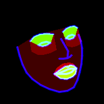
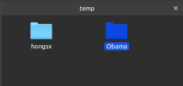
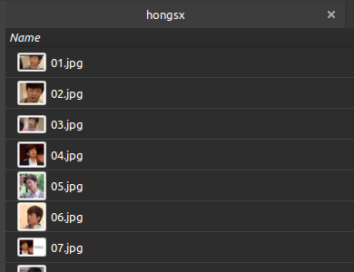
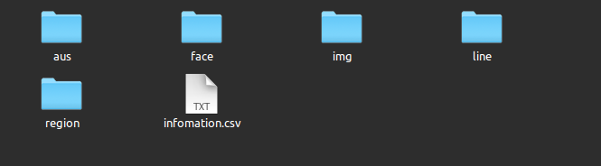
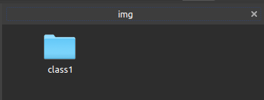
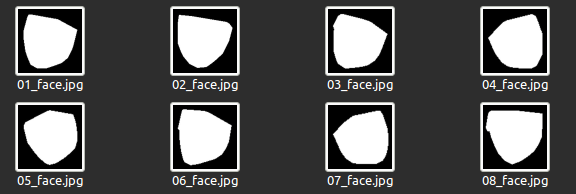
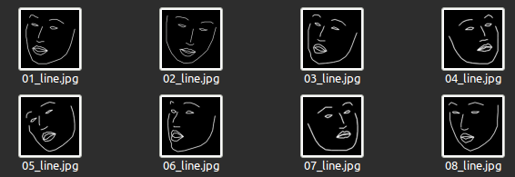
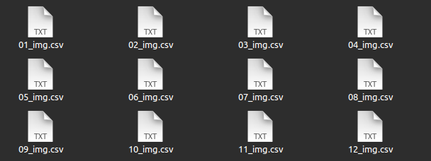

# 一键生成人脸的掩码以及表情au

## 示例




## 图片集示例

**输入**



<center>图1. 输入路径的规范</center>



<center>图2. 输入路径下的类别</center>

**输出**：



<center>图3. 输出的目录下生成的各种文件夹</center>



<center>图4. 输出的目录下生成的任意文件夹下组织方式如上</center>



<center>图5. 在face文件夹生成的掩码</center>



<center>图6. 输出的目录下生成的根据关键点绘制线图</center>



<center>图7. 生成的AUs</center>


## 准备数据：

```shell
视频，组织方式为：
input_dir\
	\class1
		\video1
		\video2
		...
	\class2
		\video1
		\video2
		
图片，组织方式为：
input_dir\
	\class1
		\img1
		\img2
		...
	\class2
		\img1
		\img2
```


## 输出

```shell
output_dir\
		\aus
			\class1
				\img1.csv
				\img2.csv
			\class2
			...
    	\face
    		\class1
    		...
    	\img
		\line
		\region
```


## 配置要求

```python
Openface
dlib
face_alignment
```


## 使用

**图片**

运行文件:

```shell
python3 imgs_fold input_dir output_dir --image_size 224 --OpenFace your OpenFace build/bin/FaceLandmarksImg --scale 1.2
```

**视频**

运行文件

```python
python3 code/video_frame.py input_dir output_dir --image_size 224 --OpenFace your OpenFace build/bin/FaceLandmarksImg --scale 1.2
```

